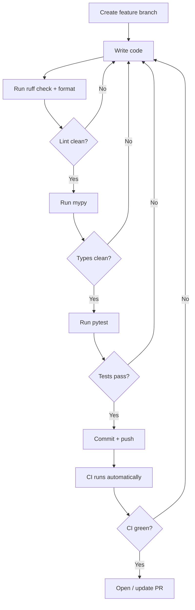
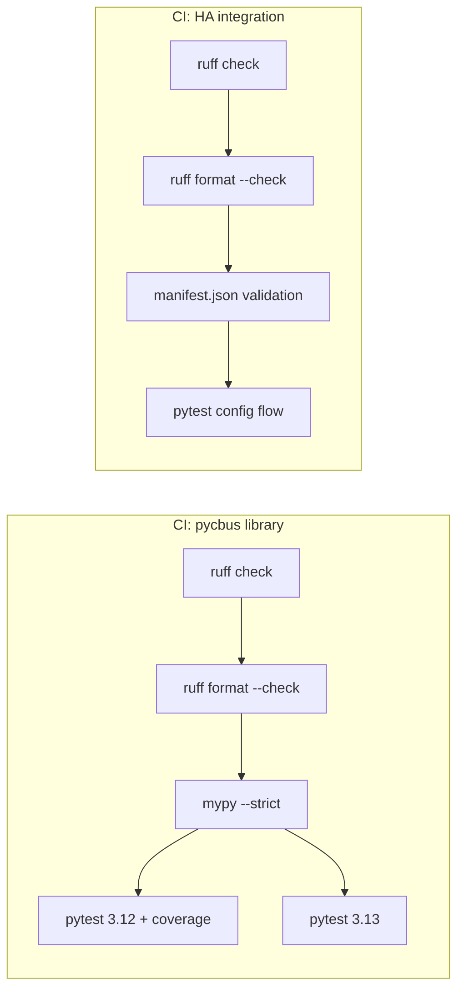

# Contributing to ha-cbus

## Prerequisites

- Python 3.12+ (3.13 also tested in CI)
- Git
- A C-Bus PCI or CNI is **not** required for development — the library
  includes offline command builders and the test suite is fully mocked.

## Quick start

```bash
# Clone and enter the repo
git clone https://github.com/DamianFlynn/ha-cbus.git
cd ha-cbus

# Create a virtual environment
python3 -m venv .venv
source .venv/bin/activate

# Install the library in editable mode with dev dependencies
pip install -e ".[dev]"

# (Optional) Install HA test framework for integration tests
pip install pytest-homeassistant-custom-component
```

## Tooling overview

| Tool | Purpose | Config |
|---|---|---|
| [ruff](https://docs.astral.sh/ruff/) | Linting + formatting (replaces flake8, isort, black) | `pyproject.toml` `[tool.ruff]` |
| [mypy](https://mypy-lang.org/) | Static type checking (strict mode) | `pyproject.toml` `[tool.mypy]` |
| [pytest](https://docs.pytest.org/) | Test runner with async and coverage support | `pyproject.toml` `[tool.pytest]` |
| [pytest-cov](https://pytest-cov.readthedocs.io/) | Coverage reporting | via `--cov` flag |
| [pytest-homeassistant-custom-component](https://github.com/MatthewFlamworthy/pytest-homeassistant-custom-component) | HA integration test fixtures (`hass`, `enable_custom_integrations`) | optional install |

### Ruff rule set

The project enables these [ruff rule categories](https://docs.astral.sh/ruff/rules/):

```toml
select = ["E", "F", "I", "UP", "B", "SIM", "TCH", "RUF"]
```

| Rule | What it catches |
|---|---|
| `E` / `F` | pycodestyle errors + pyflakes |
| `I` | isort import ordering |
| `UP` | pyupgrade (modern Python syntax) |
| `B` | flake8-bugbear (common pitfalls) |
| `SIM` | flake8-simplify (unnecessary complexity) |
| `TCH` | flake8-type-checking (move imports to `TYPE_CHECKING`) |
| `RUF` | Ruff-specific rules (unused noqa, etc.) |

## Development workflow



### 1. Branch

Always work in a feature branch:

```bash
git checkout -b feat/my-feature
```

### 2. Lint and format

```bash
# Check for lint errors
ruff check pycbus/ tests/ custom_components/

# Auto-fix what ruff can
ruff check --fix pycbus/ tests/ custom_components/

# Check formatting (dry run)
ruff format --check pycbus/ tests/ custom_components/

# Apply formatting
ruff format pycbus/ tests/ custom_components/
```

### 3. Type check

```bash
mypy pycbus/
```

Mypy runs in strict mode — all functions need type annotations and
third-party imports must be typed or stubbed.

### 4. Test

```bash
# Run all tests
python -m pytest tests/ -v

# Run with coverage
python -m pytest tests/ --cov=pycbus --cov-report=term-missing

# Run only library tests (no HA dependency)
python -m pytest tests/ -v --ignore=tests/test_config_flow.py

# Run only integration tests (requires pytest-homeassistant-custom-component)
python -m pytest tests/test_config_flow.py -v
```

### 5. Use the CLI

The `pycbus` CLI works without any hardware connection for the `build`
and `checksum` sub-commands:

```bash
# Build a Lighting ON frame
pycbus build on --group 1

# Build a ramp command
pycbus build ramp --group 5 --level 128 --rate 4s

# Compute a checksum
pycbus checksum 05 38 00 79 01 FF

# Verify a frame checksum
pycbus checksum --verify 05 38 00 79 01 FF 50
```

## CI pipelines

Two GitHub Actions workflows run automatically on push/PR:



### CI: pycbus library (`ci-library.yml`)

Triggered when `pycbus/`, `tests/`, or `pyproject.toml` change.

| Job | Steps |
|---|---|
| **Lint & type-check** | `ruff check` → `ruff format --check` → `mypy --strict` |
| **Test (3.12)** | `pytest tests/ --cov` + upload coverage artifact |
| **Test (3.13)** | `pytest tests/` |

Integration tests (`test_config_flow.py`) are automatically skipped in
this pipeline via `pytest.importorskip("homeassistant")`.

### CI: HA integration (`ci-integration.yml`)

Triggered when `custom_components/`, `tests/test_config_flow.py`, or
`tests/conftest.py` change.

| Job | Steps |
|---|---|
| **Validate** | `ruff check` → `ruff format --check` → manifest.json schema check |
| **Test** | `pytest tests/test_config_flow.py` with `pytest-homeassistant-custom-component` |

## Versioning

| Component | Scheme | Current | Where |
|---|---|---|---|
| `pycbus` library | [SemVer](https://semver.org/) | `0.1.0` | `pyproject.toml` `version` |
| HA integration | [CalVer](https://calver.org/) `YYYY.M.PATCH` | `2026.4.0` | `manifest.json` `version` |

- Bump `pycbus` version for library changes (breaking → major, feature → minor, fix → patch).
- Bump the integration version to match the current HA release cycle.

## Test structure

```
tests/
├── conftest.py              # Shared fixtures; HA fixtures only load
│                            # when pytest-homeassistant-custom-component
│                            # is installed
├── test_checksum.py         # 4 tests  — checksum algorithm
├── test_commands.py         # 4 tests  — SAL command builders
├── test_constants.py        # 27 tests — enum values, ramp table, bitmasks
├── test_model.py            # 15 tests — dataclass validation
├── test_cli.py              # 16 tests — CLI build/checksum sub-commands
├── test_config_flow.py      # 8 tests  — HA config flow (needs HA)
└── test_protocol.py         # stub     — protocol state machine (planned)
```

**Total: 74 tests** (66 library + 8 integration)

The `conftest.py` uses a `try/except ImportError` guard so that HA-specific
fixtures (`auto_enable_custom_integrations`, `mock_setup_entry`) are only
defined when the HA test package is installed. This means library tests
work with just `pip install -e ".[dev]"`.

## Code style guidelines

- **Line length**: 88 characters (ruff default)
- **Imports**: sorted by ruff (`I` rules), type-only imports in `TYPE_CHECKING` blocks (`TCH` rules)
- **Docstrings**: every public module, class, and function gets a docstring
- **Type annotations**: all function signatures must be fully typed (mypy strict)
- **ASCII only in source**: no smart quotes, em-dashes, or non-ASCII in strings (ruff `RUF001`/`RUF002`)
