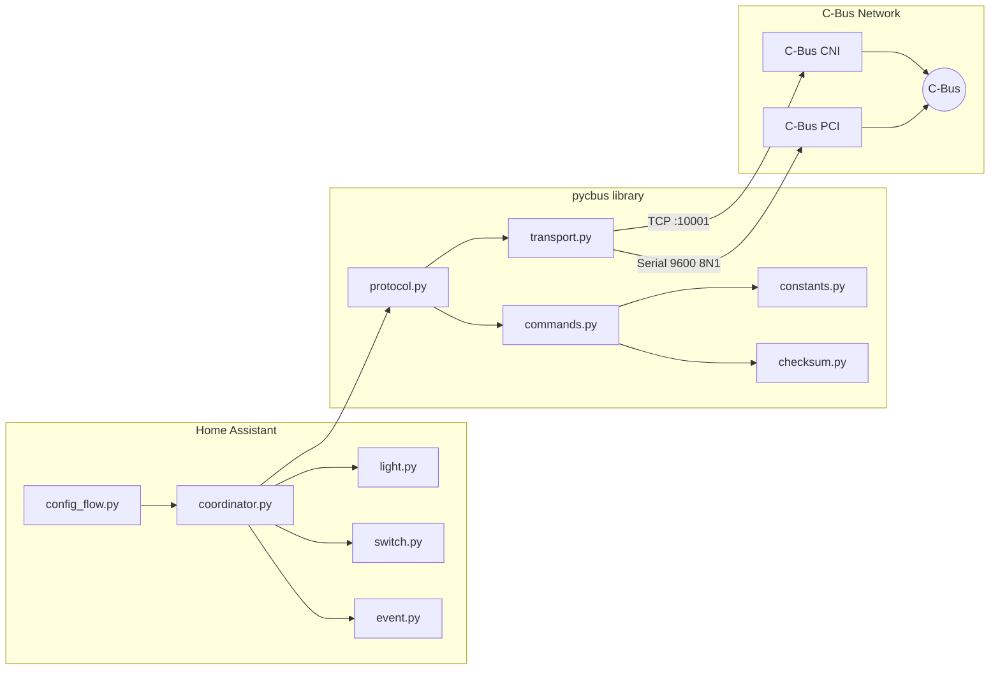

# ha-cbus — Native Home Assistant Integration for Clipsal C-Bus

[](LICENSE)
[](https://github.com/DamianFlynn/ha-cbus/actions/workflows/ci-library.yml)
[](https://github.com/DamianFlynn/ha-cbus/actions/workflows/ci-integration.yml)
[](https://hacs.xyz)

A native [Home Assistant](https://www.home-assistant.io/) integration for
[Clipsal C-Bus](https://www.clipsal.com/products/c-bus) home automation —
communicating directly with PCI/CNI hardware over serial or TCP. No C-Gate
server required.

## Status

**Pre-alpha** — the protocol library (`pycbus`) has working checksum,
command builders, model, and CLI. The HA integration has a functional
config flow with full test coverage. Transport and protocol layers are
next.

## Architecture

Two packages live in one repository:

| Package | Version | Purpose |
|---|---|---|
| `pycbus` | 0.1.0 (SemVer) | Pure-Python async C-Bus protocol library |
| `custom_components/cbus` | 2026.4.0 (CalVer) | Home Assistant custom integration |



### Repository layout

```
ha-cbus/
├── pycbus/                     # Protocol library (SemVer)
│   ├── __init__.py             # Package metadata, version
│   ├── checksum.py             # Two's-complement checksum
│   ├── commands.py             # SAL command builders (lighting)
│   ├── constants.py            # Protocol enums and lookup tables
│   ├── model.py                # Project → Network → App → Group dataclasses
│   ├── transport.py            # Async transport interface (TCP / serial)
│   ├── protocol.py             # PCI/CNI state machine (stub)
│   ├── cli.py                  # Standalone CLI tool
│   ├── __main__.py             # python -m pycbus entry point
│   └── applications/           # Per-application SAL definitions (stub)
├── custom_components/cbus/     # HA integration (CalVer)
│   ├── __init__.py             # async_setup_entry / async_unload_entry
│   ├── config_flow.py          # 3-step UI flow (transport → TCP/serial → done)
│   ├── const.py                # DOMAIN, transport constants
│   ├── coordinator.py          # DataUpdateCoordinator (stub)
│   ├── entity.py               # Base entity (stub)
│   ├── light.py                # Lighting platform (stub)
│   ├── switch.py               # Enable Control platform (stub)
│   ├── event.py                # Trigger Control platform (stub)
│   ├── manifest.json           # Integration metadata
│   ├── strings.json            # UI strings
│   └── translations/en.json    # English translations
├── tests/                      # Shared test directory
│   ├── conftest.py             # Fixtures (HA-aware, gracefully degrades)
│   ├── test_checksum.py        # Checksum algorithm tests
│   ├── test_commands.py        # SAL command builder tests
│   ├── test_constants.py       # Enum completeness / value tests
│   ├── test_model.py           # Dataclass validation tests
│   ├── test_cli.py             # CLI sub-command tests
│   ├── test_config_flow.py     # HA config flow tests (skipped without HA)
│   └── test_protocol.py        # Protocol state machine tests (stub)
├── docs/                       # Design documents and protocol references
├── .github/workflows/          # CI pipelines
│   ├── ci-library.yml          # pycbus: lint → type-check → test (3.12 + 3.13)
│   └── ci-integration.yml      # HA: validate manifest → test config flow
└── pyproject.toml              # Build config, tool settings, CLI entry point
```

## Features

### Working now

- **Checksum** — two's-complement calculation and verification per the C-Bus Serial Interface spec
- **Command builders** — `lighting_on()`, `lighting_off()`, `lighting_ramp()`, `lighting_terminate_ramp()`
- **Protocol constants** — all 16+ application IDs, lighting opcodes, ramp duration table, interface options
- **Data model** — `CbusProject → CbusNetwork → CbusApplication → CbusGroup` hierarchy with validation
- **Config flow** — 3-step UI: choose transport (TCP/serial) → enter details → create entry, with duplicate detection
- **CLI tool** — `pycbus build`, `pycbus checksum` for offline command building and verification
- **CI/CD** — two pipelines with ruff, mypy strict, pytest matrix, coverage artifacts

### Planned

- **Transport layer** — async TCP and serial connections
- **Protocol state machine** — PCI/CNI init sequence, SAL send/confirm, monitor events
- **Entity platforms** — light (dimming + ramp), switch, event
- **Device import** — import group labels from C-Gate XML or Toolkit CBZ files

## CLI tool

The `pycbus` CLI lets you test C-Bus commands without Home Assistant:

```bash
# Build a Lighting ON command and display the hex frame
pycbus build on --group 1
# 0538007901FF50

# Build a ramp-to-50% over 4 seconds
pycbus build ramp --group 5 --level 128 --rate 4s
# 0538000A058034

# Compute a checksum
pycbus checksum 05 38 00 79 01 FF
# 50

# Verify a checksummed frame
pycbus checksum --verify 05 38 00 79 01 FF 50
# OK
```

## Installation

> **Not yet available** — the integration will be installable via
> [HACS](https://hacs.xyz) once the transport and protocol layers are complete.

For development, see [CONTRIBUTING.md](CONTRIBUTING.md).

## Documentation

| Document | Description |
|---|---|
| [CONTRIBUTING.md](CONTRIBUTING.md) | Development setup, tooling, test workflow |
| [docs/PRD.md](docs/PRD.md) | Product requirements |
| [docs/DESIGN.md](docs/DESIGN.md) | Architecture and design decisions |
| [docs/DISCOVERY.md](docs/DISCOVERY.md) | Device discovery strategy |
| [docs/references/](docs/references/) | C-Bus protocol PDFs (Serial Interface Guide, application chapters) |

## License

[Apache-2.0](LICENSE)
