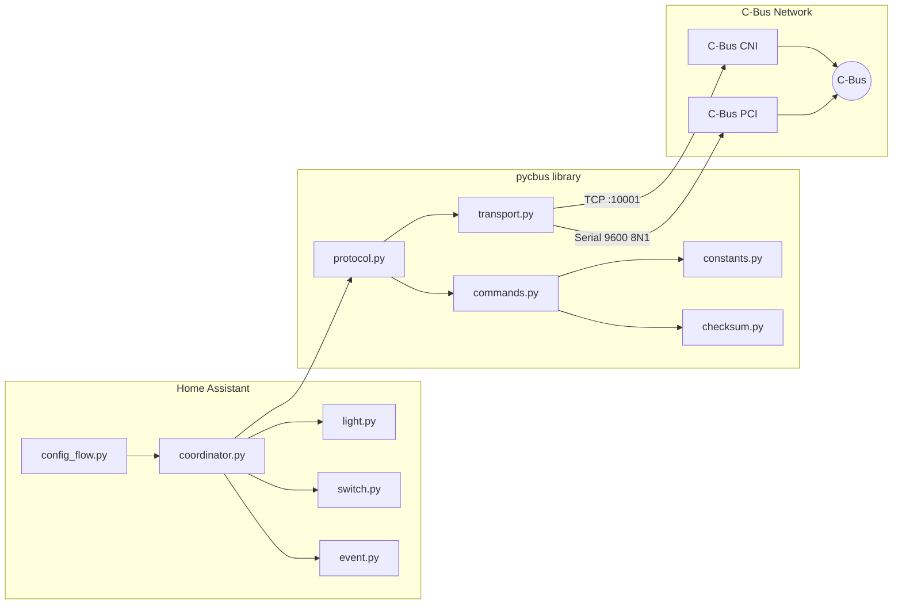

# ha-cbus — Native Home Assistant Integration for Clipsal C-Bus

[](LICENSE)
[](https://github.com/DamianFlynn/ha-cbus/actions/workflows/ci-library.yml)
[](https://github.com/DamianFlynn/ha-cbus/actions/workflows/ci-integration.yml)
[](https://hacs.xyz)

A native [Home Assistant](https://www.home-assistant.io/) integration for
[Clipsal C-Bus](https://www.clipsal.com/products/c-bus) home automation —
communicating directly with PCI/CNI hardware over serial or TCP. No C-Gate
server required.

## Status

**Alpha** — the protocol library (`pycbus`) has a working async
protocol stack: transport (TCP + serial), PCI/CNI init state machine
with SMART mode, SAL command builders for lighting/enable/trigger, SAL
monitor event parsing, binary status request/reply, and a measurement
application parser. The HA integration has config flow, coordinator
with state cache, and light/switch/event entity platforms. 236 tests,
two CI pipelines (Python 3.12 + 3.13).

## Architecture

Two packages live in one repository:

| Package | Version | Purpose |
|---|---|---|
| `pycbus` | 0.1.0 (SemVer) | Pure-Python async C-Bus protocol library |
| `custom_components/cbus` | 2026.4.0 (CalVer) | Home Assistant custom integration |



### Repository layout

```
ha-cbus/
├── pycbus/                     # Protocol library (SemVer)
│   ├── __init__.py             # Package metadata, version
│   ├── checksum.py             # Two's-complement checksum
│   ├── commands.py             # Shared SAL infrastructure + re-exports
│   ├── constants.py            # Protocol enums and lookup tables
│   ├── model.py                # Project → Network → App → Group dataclasses
│   ├── exceptions.py           # CbusError, CbusConnectionError, CbusTimeoutError
│   ├── transport.py            # Async TCP + serial transport
│   ├── protocol.py             # PCI/CNI state machine (SMART mode)
│   ├── cli.py                  # pycbus package CLI (build/checksum/send/monitor)
│   └── applications/           # Per-application SAL definitions
│       ├── __init__.py         # Registry + shared builder
│       ├── lighting.py         # Lighting (app 0x38) on/off/ramp
│       ├── enable.py           # Enable Control (app 0xCB) on/off
│       ├── trigger.py          # Trigger Control (app 0xCA) events
│       └── measurement.py      # Measurement (app 0xE4) sensor parser
├── cli/                        # Standalone CLI tool
│   ├── __init__.py
│   ├── __main__.py             # python -m cli entry point
│   └── cbus_cli.py             # Full CLI: light/switch/trigger/monitor/status
├── custom_components/cbus/     # HA integration (CalVer)
│   ├── __init__.py             # async_setup_entry / async_unload_entry
│   ├── config_flow.py          # 3-step UI flow (transport → TCP/serial → done)
│   ├── const.py                # DOMAIN, transport constants
│   ├── coordinator.py          # State cache, SAL dispatch, command proxy
│   ├── entity.py               # Base CbusEntity
│   ├── light.py                # Lighting platform (brightness + ramp)
│   ├── switch.py               # Enable Control platform (binary on/off)
│   ├── event.py                # Trigger Control platform (fire-and-forget)
│   ├── manifest.json           # Integration metadata
│   ├── strings.json            # UI strings
│   └── translations/en.json    # English translations
├── tests/                      # Test suite (236 tests)
│   ├── conftest.py             # Root fixtures
│   ├── lib/                    # Library-only tests (150 tests)
│   │   ├── test_checksum.py    #   4 — checksum algorithm
│   │   ├── test_commands.py    #  49 — SAL builders + parsers
│   │   ├── test_constants.py   #  28 — enums, bitmasks, spec compliance
│   │   ├── test_model.py       #  14 — dataclass validation
│   │   ├── test_protocol.py    #  23 — protocol state machine
│   │   └── test_transport.py   #  32 — TCP + serial + CRLF edge cases
│   ├── cli/                    # CLI tests (21 tests)
│   │   └── test_cli.py         #  21 — build/checksum sub-commands
│   └── integration/            # HA integration tests (65 tests)
│       ├── test_config_flow.py #   8 — config flow
│       ├── test_coordinator.py #  22 — coordinator state + dispatch
│       ├── test_light.py       #  16 — light entity
│       ├── test_switch.py      #  10 — switch entity
│       └── test_event.py       #   9 — event entity
├── docs/                       # Design documents and protocol references
├── .github/workflows/          # CI pipelines
│   ├── ci-library.yml          # pycbus: lint → type-check → test (3.12 + 3.13)
│   └── ci-integration.yml      # HA: validate manifest → test integration
└── pyproject.toml              # Build config, tool settings
```

## Features

### Working now

- **Transport layer** — async TCP (port 10001) and serial (9600 8N1) with CRLF-safe framing
- **Protocol state machine** — PCI/CNI init (SMART + MONITOR + IDMON), SAL send with confirmation codes, monitor event parsing, binary status request/reply
- **Command builders** — `lighting_on/off/ramp/terminate_ramp`, `enable_on/off`, `trigger_event`, with per-application modules in `pycbus/applications/`
- **Measurement parser** — SNEL light-level sensor (app 0xE4) broadcast decoding with unit labels
- **Checksum** — two's-complement calculation and verification per the C-Bus Serial Interface spec
- **Protocol constants** — 16+ application IDs (verified against chapter PDFs), lighting/enable/trigger opcodes, ramp duration table, interface option bitmasks
- **Data model** — `CbusProject -> CbusNetwork -> CbusApplication -> CbusGroup` hierarchy with validation
- **Config flow** — 3-step UI: choose transport (TCP/serial) -> enter details -> create entry, with duplicate detection
- **Coordinator** — state cache, SAL event dispatch to entities, command proxy
- **Entity platforms** — light (brightness + ramp), switch (Enable Control), event (Trigger Control)
- **CLI tools** — `python -m cli` for full control (light/switch/trigger/monitor/status) and `pycbus/cli.py` for offline build/checksum
- **CI/CD** — two pipelines with ruff, mypy strict, pytest matrix (3.12 + 3.13), coverage artifacts

### Planned

- **Device import** — import group labels from C-Gate XML or Toolkit CBZ files
- **Measurement sensor** — HA sensor entity for SNEL light-level broadcasts

## CLI tools

### Standalone CLI (`python -m cli`)

Full-featured CLI for controlling and monitoring a live C-Bus network:

```bash
# Turn on a light
python -m cli light on --host 192.168.1.50 --group 1

# Monitor all C-Bus traffic
python -m cli monitor --host 192.168.1.50

# Query group status
python -m cli status --host 192.168.1.50
```

### Offline CLI (`pycbus/cli.py`)

Build and verify commands without hardware:

```bash
# Build a Lighting ON command and display the hex frame
python -c "from pycbus.cli import main; main(['build', 'on', '--group', '1'])"

# Compute a checksum
python -c "from pycbus.cli import main; main(['checksum', '05', '38', '00', '79', '01', 'FF'])"
```

## Installation

> **Alpha** — the integration can be installed via
> [HACS](https://hacs.xyz) as a custom repository. Transport and protocol
> layers are functional.

For development, see [CONTRIBUTING.md](CONTRIBUTING.md).

## Documentation

| Document | Description |
|---|---|
| [CONTRIBUTING.md](CONTRIBUTING.md) | Development setup, tooling, test workflow |
| [docs/PRD.md](docs/PRD.md) | Product requirements |
| [docs/DESIGN.md](docs/DESIGN.md) | Architecture and design decisions |
| [docs/DISCOVERY.md](docs/DISCOVERY.md) | Device discovery strategy |
| [docs/references/](docs/references/) | C-Bus protocol PDFs (Serial Interface Guide, application chapters) |

## License

[Apache-2.0](LICENSE)
